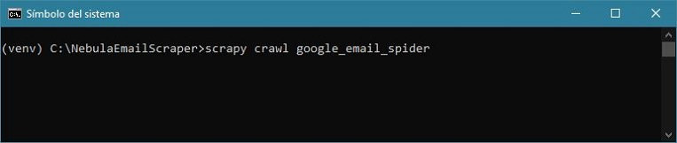

# Nebula Email Scraper
The main goal of this scraper is to extract emails from websites for use in email marketing campaigns. Its main feature is that you can segment using keywords so you can make a deep scraping by subject.




## Features
* Made with Scrapy
* Very precise Regex for email extraction.
* Custom priority requests to not hit google too hard in a little time frame. 
* Make use of a pipeline to clean all the data so just unique email addresses are retrieved.
* Data output in a prettified "emails.json" JSON file.

## TO DO
* Save data in a database instead of a JSON File.
* Make a proxy downloader middleware.
* Add other search engines. 

## Installation and running 
To install and run this project copy or clone all the files to your preferred folder and type and execute:

```bash
pip install -r requirements.txt
scrapy crawl google_email_spider
```
The first time you do a crawl a "keywords.txt" file will be created if it does not exist. When the scrapy spider stops, a file called "emails.json" will be outputted. Both files will appear in the root directory, where "scrapy.cfg" resides).

Nebula Email Scraper was developed under `Python 3.10.4`using `Scrapy 2.6.1` and it's recommended to run in a virtual environment.